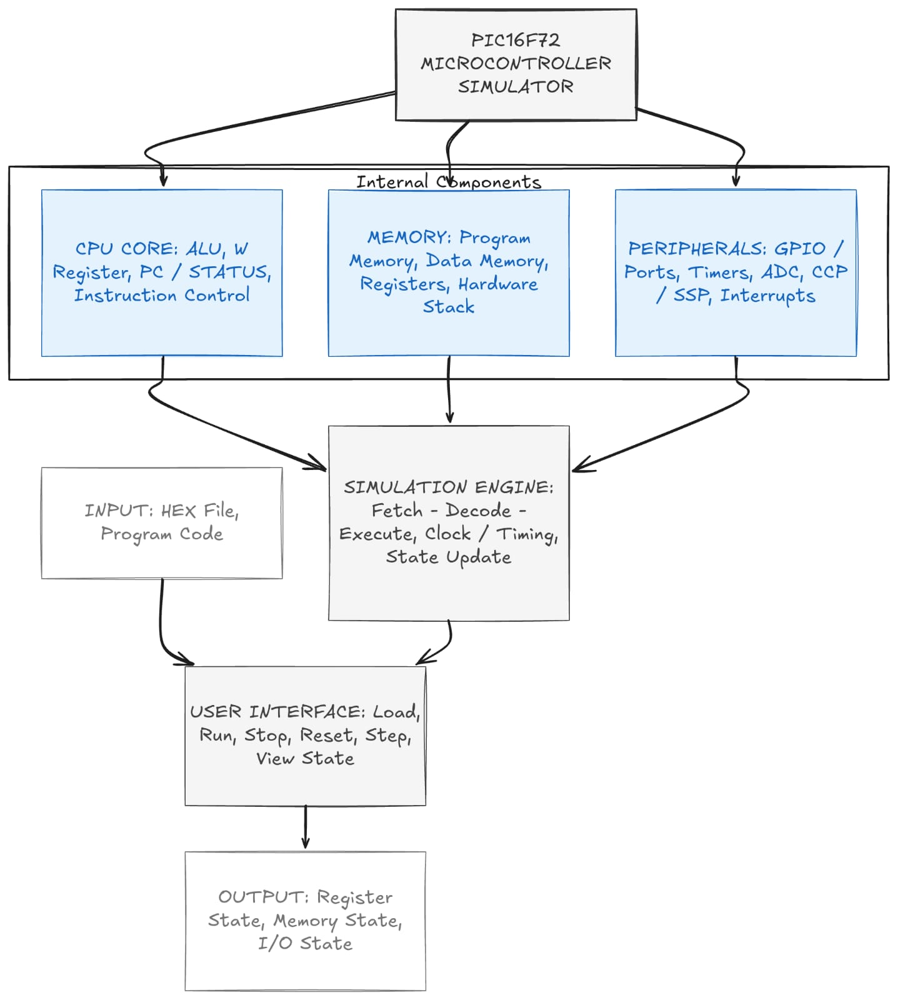

# Educational PIC16F72 Microcontroller Simulator

## Project Overview

This project is a Java-based educational simulator for the PIC16F72
8-bit microcontroller.

The project combines:

- Microprocessor Architecture
- Data Structures
- Operating Systems

## Problem Objective

The main objective is to create a simple simulator that helps students
understand how the PIC16F72 works and how CPU scheduling manages
multiple processes.

## Problem Statement

The simulator will model basic processor components such as registers,
Program Counter, memory, stack, and instruction execution.

It will also include basic GPIO, timer, and interrupt simulation.

The project will represent multiple programs as processes and demonstrate
FCFS, Round Robin, and Priority Scheduling.

## Project Scope

The project will cover:

- CPU and instruction execution
- Registers and memory
- Stack
- GPIO and Timer
- Interrupts
- Process management
- Ready queue and PCB
- Context switching
- CPU scheduling

## Microcontroller

**PIC16F72**

The simulator will focus on the important features of the PIC16F72
required for this project rather than the complete microcontroller.

## Programming Language

**Java**

### Why Java?

Java was selected because it:

- Supports object-oriented programming
- Provides useful data structures
- Makes scheduling algorithms easy to implement
- Supports GUI development
- Is suitable for building a simulator

### Limitation

Java can simulate the microcontroller, but it cannot completely
reproduce real hardware behaviour.

## System Architecture

## Team

| Member | Responsibility |
|--------|----------------|
| Naseef | CPU & Instruction Execution |
| Moksha | Memory & Stack |
| Anas | Data Structures & Process Management |
| Chinmay | Scheduling & Context Switching |

## Development Plan

### Week 1
- Project setup
- PIC16F72 architecture study
- Language selection
- Initial architecture
- Team responsibility allocation

### Week 2
- CPU and memory implementation
- Instruction execution

### Later
- Process management
- Scheduling algorithms
- Context switching
- Peripherals
- Testing and integration

## Project Status

**Week 1 – Planning and Development Setup**
